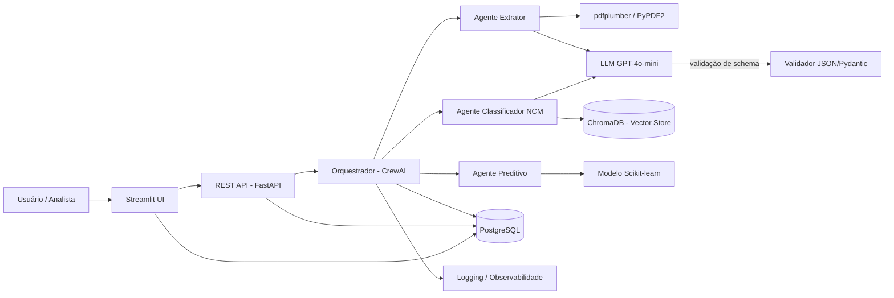
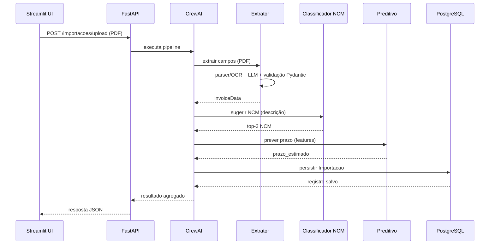
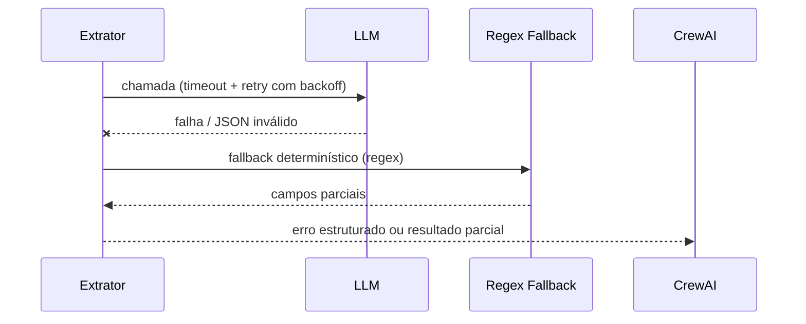
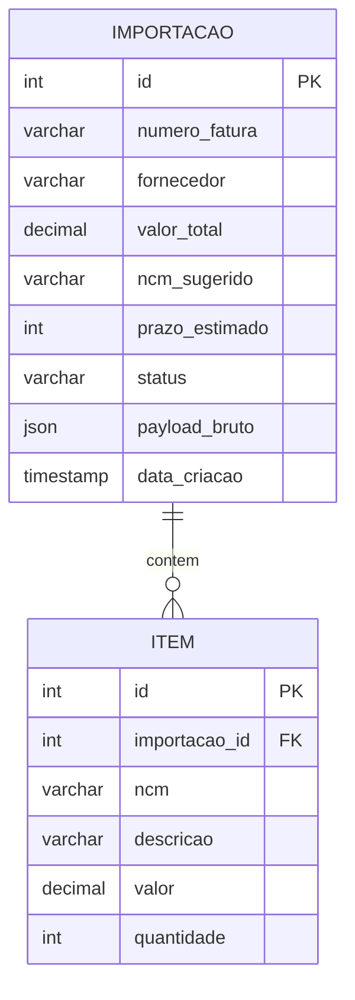

# Plano de Implementação — TradeFlow

> Documento gerado a partir do prompt `prompt-plano-implementacao.md`. Atua como roadmap técnico do projeto descrito em `tradeflow.md`.

---

## 1. Visão geral da arquitetura e fluxo de dados

O TradeFlow é um pipeline de IA em 5 estágios: **receber** documentos → **extrair** dados → **classificar NCM** (RAG) → **prever** prazo/custo → **persistir e expor** os resultados.



**Fluxo de sequência — caminho feliz:**



**Fluxo de sequência — caminho de erro/fallback:**



**Modelo de dados (ERD):**



**Contratos de dados (exemplos concretos):**

`InvoiceData` (saída da extração):

```json
{
  "numero_fatura": "INV-2026-0842",
  "fornecedor": "Tech Global Ltd.",
  "valor_total_usd": 12850.40,
  "peso_bruto_kg": 320.5,
  "incoterm": "FOB",
  "volumes": 12,
  "itens": [
    {"ncm": "8528.72.00", "descricao": "Televisor LED 55\"", "quantidade": 10, "valor": 12850.40}
  ]
}
```

`POST /importacoes/upload` (response):

```json
{
  "id": 42,
  "status": "pendente_revisao",
  "numero_fatura": "INV-2026-0842",
  "ncm_sugerido": "8528.72.00",
  "prazo_estimado_dias": 9,
  "payload_bruto": { "...": "JSON completo da extração" }
}
```

**Decisões de arquitetura (ADRs):** registrar as escolhas importantes em `docs/adr/` (CrewAI vs LangChain puro, ChromaDB vs Pinecone, SQLite vs PostgreSQL, síncrono vs fila) com contexto, decisão e consequências.

**Princípios de arquitetura:**
- **Camadas:** UI → API → Orquestração → Domínio (extraction, ncm, prediction) → Infraestrutura (storage, config).
- **Domínio desacoplado:** a lógica de extração, classificação e predição **não conhece** a UI nem a API. O orquestrador apenas coordena.
- **Interfaces estáveis:** cada módulo expõe contratos claros (ex.: `extract_fields(pdf_path) -> InvoiceData`) para permitir troca de implementações (pdfplumber → outro parser; ChromaDB → Pinecone; SQLite → PostgreSQL).

---

## 2. Estrutura de pastas

```
tradeflow/
├── extraction/            # leitura de PDF + extração de campos estruturados
│   ├── parser.py          # extração de texto (pdfplumber/PyPDF2)
│   ├── extractor.py       # extração de campos via LLM + validação Pydantic
│   └── schemas.py         # modelos de dados (InvoiceData, PackingListData, etc.)
├── ncm/                   # RAG + classificação NCM
│   ├── embedder.py        # geração de embeddings
│   ├── vector_store.py    # interface + implementação ChromaDB
│   └── classifier.py      # similarity_search + sugestão de NCM
├── prediction/            # modelo preditivo + treino/avaliação
│   ├── train.py           # treino e avaliação do modelo
│   ├── model.py           # carregamento e inferência
│   └── preprocess.py      # feature engineering e encoding
├── agents/                # orquestração (CrewAI/LangChain) — só coordena
│   ├── crew.py            # definição de Agent, Task e Crew
│   └── pipeline.py        # execução do fluxo completo
├── storage/               # repositórios SQL e banco vetorial
│   ├── db.py              # engine/session (SQLAlchemy)
│   ├── models.py          # modelos ORM (Importacao, etc.)
│   └── repositories.py    # padrão Repository (CRUD)
├── api/                   # REST API (FastAPI)
│   ├── main.py            # app FastAPI + rotas
│   ├── routes/            # endpoints (upload, importacoes, previsao)
│   └── schemas.py         # DTOs de request/response (Pydantic)
├── ui/                    # interface Streamlit
│   └── app.py             # dashboard + upload + exibição
├── config/                # configuração e segredos (variáveis de ambiente)
│   └── settings.py        # carregamento de .env (pydantic-settings)
├── utils/                 # logging, validação, helpers
│   ├── logging.py         # logging estruturado
│   └── llm.py             # client LLM, retry, cache, validação de saída
├── jobs/                  # processamento assíncrono (fila/workers)
├── tests/                 # testes unitários, de integração e e2e
├── data/                  # datasets locais (tabela_ncm.csv, historico)
│   ├── raw/               # dados brutos (versionados com DVC)
│   └── processed/         # dados tratados
├── models/                # artefatos de modelo serializados (joblib) — via DVC
├── docs/adr/              # Architecture Decision Records
├── notebooks/             # EDA e experimentos (opcional)
├── .env.example           # exemplo de variáveis de ambiente
├── pyproject.toml         # dependências + tooling (uv, ruff, black)
└── README.md
```

---

## 3. Fases de implementação

### Fase 0 — Fundação do projeto

- **Objetivo/escopo:** criar a estrutura do repositório, ambiente virtual, gerenciamento de dependências, configuração central e base de logging.
- **Tarefas:**
  1. Inicializar o repositório Git e criar a estrutura de pastas acima.
  2. Criar `pyproject.toml` (dependências pinadas + tooling `ruff` + `black`) e gerenciar com `uv`.
  3. Criar `config/settings.py` usando `pydantic-settings`, lendo todas as chaves de `.env` (OpenAI API key, DB URL, etc.).
  4. Criar `.env.example` **sem segredos reais** e adicionar `.env` ao `.gitignore`.
  5. Configurar `utils/logging.py` com logging estruturado (JSON) e correlation ID.
  6. Criar um teste de smoke e um workflow de CI mínimo (lint + testes).
  7. Inicializar `docs/adr/` e registrar as decisões iniciais (ADRs).
- **Esforço estimado:** S (Small) — 2 dias.
- **Tecnologias/padrões:** Git, venv, `pydantic-settings`, `python-dotenv`, `ruff`, `black`, `pytest`, GitHub Actions. Padrão **Settings** (configuração centralizada).
- **Critérios de aceitação:**
  - `pytest` roda com sucesso o teste de smoke.
  - Nenhum segredo versionado no Git (`.env` no `.gitignore`).
  - `ruff` e `black` passam sem erros.
- **Dependências:** nenhuma (início do projeto).

---

### Fase 1 — Extração estruturada de documentos

- **Objetivo/escopo:** implementar a leitura de PDF (texto ou imagem) e a extração de campos estruturados de uma Commercial Invoice com validação de saída e fallback determinístico.
- **Tarefas:**
  1. `extraction/parser.py`: extrair texto com `pdfplumber` (fallback `PyPDF2`); detectar se o PDF tem camada de texto — se não, aplicar **OCR** com `pytesseract`/`ocrmypdf`.
  2. `extraction/schemas.py`: modelar `InvoiceData` com Pydantic (numero_fatura, fornecedor, valor_total, peso_bruto, incoterm, volumes, itens), validando tipos e formatos (ex.: incoterm ∈ {EXW, FOB, CIF, ...}).
  3. `extraction/extractor.py`: prompt Few-Shot + Chain-of-Thought com delimitadores explícitos (dados vs. instruções), retornando JSON.
  4. `extraction/regex_fallback.py`: fallback determinístico por regex (número da fatura, valores, peso) usado quando o LLM falha ou retorna JSON inválido.
  5. `utils/llm.py`: client LLM com timeout, retry com backoff exponencial e validação da saída contra o schema Pydantic.
  6. Criar **golden dataset** com 10 PDFs anotados (ground truth) para medir a precisão da extração.
  7. Testes unitários mockando o LLM e testes de integração com PDFs de exemplo.
- **Esforço estimado:** M (Medium) — 4 dias.
- **Tecnologias/padrões:** `pdfplumber`, `PyPDF2`, `pytesseract`/`ocrmypdf`, `openai`, Pydantic, `regex`. Padrões **Adapter** (parsers intercambiáveis), **Strategy** (LLM vs. regex fallback) e **Schema Validation**.
- **Critérios de aceitação:**
  - Extração correta dos 6 campos em ≥ 90% do golden dataset.
  - PDF escaneado (sem texto) é processado via OCR com sucesso.
  - Falha do LLM aciona o fallback regex e nunca gera exceção não controlada.
  - Testes unitários com LLM mockado rodam < 1s.
- **Dependências:** Fase 0.

---

### Fase 2 — RAG para classificação NCM

- **Objetivo/escopo:** criar o pipeline RAG que sugere os 3 códigos NCM mais prováveis para uma descrição de produto.
- **Tarefas:**
  1. Preparar a base `data/tabela_ncm.csv` (NCM, descrição, alíquota) a partir da Tabela TIPI.
  2. `ncm/embedder.py`: gerar embeddings com `OpenAIEmbeddings` e cache por lote.
  3. `ncm/vector_store.py`: interface `VectorStore` + implementação `ChromaVectorStore` (padrão **Repository/Strategy**), com metadados.
  4. `ncm/classifier.py`: `suggest_ncm(descricao, k=3)` usando `similarity_search`.
  5. Criar **golden dataset** de referência (descrição → NCM esperado), versionado com DVC.
  6. Avaliação de qualidade: medir precisão@1, precisão@3 e recall; opcionalmente usar **RAGAS** (faithfulness, context relevancy) para o pipeline RAG.
- **Esforço estimado:** M (Medium) — 4 dias.
- **Tecnologias/padrões:** LangChain, ChromaDB, embeddings OpenAI, DVC, RAGAS. Padrões **Strategy** (trocar banco vetorial) e **Repository**.
- **Critérios de aceitação:**
  - NCM correto entre os 3 sugeridos em ≥ 85% do golden dataset.
  - Indexação da tabela completa em tempo aceitável (< 2 min para ~10k registros).
  - Substituir a implementação do vector store não altera o `classifier.py`.
- **Dependências:** Fase 0.

---

### Fase 3 — Modelo preditivo de prazo de desembaraço

- **Objetivo/escopo:** treinar e expor um modelo que prevê o prazo de desembaraço a partir de dados históricos.
- **Tarefas:**
  1. EDA em `notebooks/` com Matplotlib/Seaborn (distribuições, correlações, outliers).
  2. `prediction/preprocess.py`: tratamento de nulos, encoding (One-Hot de incoterm/tipo_produto), normalização.
  3. `prediction/train.py`: split treino/validação/teste **antes** do fit, validação cruzada, regressão linear e árvore de decisão; seleção por RMSE/R².
  4. `prediction/model.py`: carregamento do modelo serializado (joblib) e função `predict()`.
  5. Testes: verificar que o pipeline de preprocessamento é idêntico no treino e na inferência (evitar *data leakage*).
  6. Versionar dados e artefatos com **DVC** e definir monitoramento de **drift** (comparação periódica das features de produção vs. treino).
- **Esforço estimado:** M (Medium) — 4 dias.
- **Tecnologias/padrões:** Pandas, Scikit-learn, joblib, DVC. Padrões **Pipeline** (sklearn) e **Strategy** (alternar modelos).
- **Critérios de aceitação:**
  - R² documentado e RMSE reportado no conjunto de teste.
  - Modelo persistido versionado (data + artefato via DVC).
  - Função de inferência aceita exatamente os campos que o sistema produz.
- **Dependências:** Fase 0.

---

### Fase 4 — Camada de dados (SQL) e repositórios

- **Objetivo/escopo:** persistir os resultados estruturados e os históricos em banco relacional.
- **Tarefas:**
  1. `storage/models.py`: modelos ORM `Importacao` e `Item` com SQLAlchemy, incluindo campo `status` (pendente/revisado/corrigido), `payload_bruto` (JSON) e **constraint única** (`numero_fatura` + `fornecedor`) para idempotência.
  2. `storage/db.py`: engine e session com pool de conexões e configuração por ambiente.
  3. `storage/repositories.py`: classes `ImportacaoRepository` e `ItemRepository` (padrão **Repository**).
  4. Migrações com Alembic — incluindo **downgrade/rollback** — e seed de dados de teste.
  5. Política de **backup** dos dados (dump periódico ou snapshot).
- **Esforço estimado:** S (Small) — 3 dias.
- **Tecnologias/padrões:** SQLAlchemy, Alembic, PostgreSQL (dev: SQLite via SQLAlchemy URL). Padrão **Repository** + **Unit of Work** (se necessário).
- **Critérios de aceitação:**
  - CRUD completo coberto por testes de integração.
  - Trocar SQLite por PostgreSQL muda apenas a variável de ambiente.
  - Índices criados nas colunas mais consultadas (numero_fatura, data_criacao).
  - Inserção duplicada da mesma fatura é rejeitada pela constraint única.
- **Dependências:** Fases 0 e 1.

---

### Fase 5 — Orquestração de agentes (CrewAI)

- **Objetivo/escopo:** integrar extração, classificação e predição em um fluxo único e coordenado.
- **Tarefas:**
  1. `agents/crew.py`: definir os 3 agentes (Extrator, Classificador Fiscal, Analista Preditivo) com roles/goals claros.
  2. `agents/pipeline.py`: orquestrar as tasks em sequência e agregar o resultado final em um DTO único.
  3. Tratar falhas intermediárias: se a extração falhar, o pipeline para com erro claro (não propaga para classificação).
  4. Registrar métricas de execução (latência por etapa, tokens consumidos).
  5. Executar o pipeline de forma **assíncrona** (`jobs/`), com o registro `Importacao` passando por status `pendente → processando → concluído/erro`, evitando timeout em chamadas síncronas.
  6. Garantir **idempotência**: reprocessar a mesma fatura atualiza o registro existente em vez de duplicar.
- **Esforço estimado:** M (Medium) — 4 dias.
- **Tecnologias/padrões:** CrewAI, LangChain, fila/worker (Celery ou job simples em background). Padrão **Chain of Responsibility** (etapas sequenciais com interrupção).
- **Critérios de aceitação:**
  - Pipeline completo executa de ponta a ponta com um PDF de entrada.
  - Falha em uma etapa não derruba o processo e gera log estruturado.
  - Resultado agregado contém todos os campos + NCM sugerido + prazo estimado.
  - O mesmo arquivo reprocessado não gera registro duplicado.
- **Dependências:** Fases 1, 2, 3 e 4.

---

### Fase 6 — API REST

- **Objetivo/escopo:** expor o pipeline e os dados via API para integração com sistemas legados.
- **Tarefas:**
  1. `api/main.py` + rotas: `POST /importacoes/upload` (recebe PDF, **enfileira** o pipeline e retorna `202 Accepted` com ID), `GET /importacoes/{id}/status`, `GET /importacoes`, `GET /importacoes/{id}`.
  2. `api/schemas.py`: DTOs Pydantic de request/response.
  3. Autenticação por **API key + HTTPS** (escopo mínimo para o estágio; JWT/OAuth fica como evolução) e rate limiting.
  4. Validação de upload (tipo, tamanho máximo, nome sanitizado).
- **Esforço estimado:** M (Medium) — 3 dias.
- **Tecnologias/padrões:** FastAPI, Pydantic, `slowapi` (rate limit). Padrão **DTO** + **Service**.
- **Critérios de aceitação:**
  - Endpoints documentados (Swagger) e com testes de integração.
  - Upload inválido retorna 4xx com mensagem clara.
  - Upload válido retorna 202 e o status é consultável via `GET .../status`.
  - API não acessa a UI; consome apenas os módulos de domínio e o orquestrador.
- **Dependências:** Fase 5.

---

### Fase 7 — Interface Streamlit

- **Objetivo/escopo:** dashboard que permite upload, executa o pipeline e exibe resultados.
- **Tarefas:**
  1. `ui/app.py`: upload de PDF, botão de execução, exibição dos dados extraídos, NCM sugerido e prazo estimado.
  2. Feedback de progresso (spinner por etapa / polling de status) e tratamento de erros amigável.
  3. Tabela de importações persistidas consultando via repositório.
  4. Fluxo de **revisão humana**: o analista pode marcar o registro como `revisado` ou `corrigido` (registro da correção).
- **Esforço estimado:** S (Small) — 3 dias.
- **Tecnologias/padrões:** Streamlit, `st.session_state`. Padrão **Thin UI** (lógica na camada de domínio, não na UI).
- **Critérios de aceitação:**
  - Fluxo completo executável no dashboard.
  - Nenhuma regra de negócio dentro de `ui/app.py`.
  - Registro pode ser revisado/corrigido pelo usuário e persistido.
- **Dependências:** Fase 5 (e Fase 4 para leitura do banco).

---

### Fase 8 — Hardening, avaliação e entrega

- **Objetivo/escopo:** consolidar segurança, observabilidade, testes e2e e documentação.
- **Tarefas:**
  1. Auditoria de segurança: segredos, prompt injection, LGPD (logs sem PII), análise de dependências (`pip-audit`).
  2. Testes end-to-end do fluxo completo com mocks de LLM determinísticos.
  3. Avaliação do RAG (Fase 2) e do modelo (Fase 3) com relatório de métricas.
  4. `README.md` completo (setup, execução, arquitetura, limitações) + script `setup.sh`.
  5. Contenção de custos: cache de respostas do LLM, limite de tokens, escolha de modelo.
  6. **Estimativa de custo de LLM:** medir tokens médios por documento e projetar custo mensal (ex.: 1.000 docs/mês × ~2.000 tokens × preço do gpt-4o-mini).
  7. **Monitoramento de drift e retreino:** definir métricas e gatilho para retreinar o modelo preditivo e reavaliar o RAG.
- **Esforço estimado:** S (Small) — 3 dias.
- **Tecnologias/padrões:** `pip-audit`, pytest, GitHub Actions. Padrões de **observabilidade** (métricas/logs/traces).
- **Critérios de aceitação:**
  - Checklist de boas práticas (seção 5) 100% atendido ou com justificativa de exceção.
  - CI verde (lint, testes, build).
  - Entregáveis do `tradeflow.md` prontos (README, pyproject/deps, setup, demo).
  - Relatório com custo mensal estimado e métricas de drift definidas.
- **Dependências:** todas as anteriores.

---

## 3.1 Cronograma sugerido e MVP

**Esforço total estimado:** ~26 dias (considerando dedicação parcial de estágio).

| Fase | Esforço | Sequência |
| :--- | :---: | :--- |
| Fase 0 — Fundação | S (2d) | Início |
| Fase 1 — Extração | M (4d) | Após F0 |
| Fase 2 — RAG NCM | M (4d) | Após F0 (paralelo à F1) |
| Fase 3 — Predição | M (4d) | Após F0 (paralelo à F1/F2) |
| Fase 4 — Dados SQL | S (3d) | Após F1 |
| Fase 5 — Orquestração | M (4d) | Após F1–F4 |
| Fase 6 — API REST | M (3d) | Após F5 |
| Fase 7 — Streamlit | S (3d) | Após F5 |
| Fase 8 — Hardening | S (3d) | Após F6–F7 |

**MVP vertical (demo de ponta a ponta):** Fases 0 → 1 → 2 → 7. Com isso você já tem **upload → extração → classificação NCM → dashboard** rodando de ponta a ponta, o suficiente para o vídeo de demonstração da entrevista.

**Non-goals (fora do escopo do estágio):**
- JWT/OAuth e controle fino de permissões (fica em API key + HTTPS).
- Treinamento/fine-tuning de LLMs próprios.
- Multi-tenancy e escala horizontal.
- Suporte a outros idiomas além de português/inglês nos documentos.
- Integração real com Siscomex/DUIMP (fica como evolução).

---

## 4. Matriz de riscos

| Risco | Impacto | Probabilidade | Mitigação |
| :--- | :--- | :--- | :--- |
| Alucinação do LLM na extração (dados incorretos) | Alto | Média | Validação com Pydantic, Few-Shot + CoT, revisão humana no dashboard, fallback estruturado. |
| Prompt injection via conteúdo do PDF | Alto | Média | Delimitar dados vs. instruções, sanitizar entrada, nunca executar ações baseadas em saída do LLM sem validação. |
| Vazamento de dados (data leakage) no modelo preditivo | Médio | Média | Split antes de qualquer preprocessing, pipeline único treino/inferência, validação cruzada. |
| Custo elevado de tokens LLM | Médio | Alta | Cache de respostas, batching, limite de tokens, usar GPT-4o-mini. |
| Baixa qualidade do RAG (NCM errado) | Alto | Média | Avaliação com dataset de referência, ajuste de chunking e metadados, fallback para top-k. |
| Segredos versionados no Git | Alto | Baixa | `.env` no `.gitignore`, `.env.example`, scan de segredos no CI. |
| Acoplamento UI↔lógica | Médio | Média | Thin UI, lógica apenas nas camadas de domínio, revisão de PR. |
| Falhas em chamadas externas (LLM/API) | Médio | Alta | Retry com backoff, timeout, fallback, logging estruturado. |
| Não conformidade LGPD | Alto | Baixa | Minimização de dados, logs sem PII, mascaramento de campos sensíveis. |
| Over-engineering (abstrações prematuras) | Médio | Média | Seguir estrutura de referência, adicionar abstração só quando houver 2+ implementações. |

---

## 5. Checklist de boas práticas por fase

| Boa prática | Fase 0 | F1 | F2 | F3 | F4 | F5 | F6 | F7 | F8 |
| :--- | :---: | :---: | :---: | :---: | :---: | :---: | :---: | :---: | :---: |
| Modularidade e responsabilidade única | ✅ | ✅ | ✅ | ✅ | ✅ | ✅ | ✅ | ✅ | ✅ |
| Type hints + docstrings | ✅ | ✅ | ✅ | ✅ | ✅ | ✅ | ✅ | ✅ | ✅ |
| Testes unitários (LLM mockado) | ✅ | ✅ | ✅ | ✅ | ✅ | ✅ | ✅ | ✅ | ✅ |
| Validação de entrada/saída | ✅ | ✅ | ✅ | ✅ | — | ✅ | ✅ | ✅ | ✅ |
| Tratamento de erros + retry | ✅ | ✅ | ✅ | — | ✅ | ✅ | ✅ | ✅ | ✅ |
| Segurança (segredos, LGPD, injection) | ✅ | ✅ | ✅ | ✅ | ✅ | ✅ | ✅ | ✅ | ✅ |
| Observabilidade (logs/métricas) | ✅ | ✅ | ✅ | ✅ | ✅ | ✅ | ✅ | ✅ | ✅ |
| Performance (cache, batch, índices) | — | ✅ | ✅ | ✅ | ✅ | ✅ | ✅ | ✅ | ✅ |
| Avaliação de qualidade (RAG/modelo) | — | — | ✅ | ✅ | — | — | — | — | ✅ |
| CI/CD | ✅ | ✅ | ✅ | ✅ | ✅ | ✅ | ✅ | ✅ | ✅ |
| Contenção de custos LLM | — | ✅ | ✅ | — | — | ✅ | — | — | ✅ |

---

### Recomendações finais (o que não foi pensado no `tradeflow.md`)

1. **Revisão humana:** manter um status (`pendente`, `revisado`, `corrigido`) no modelo `Importacao` — essencial num domínio fiscal onde erro gera multa.
2. **Auditabilidade:** guardar o prompt usado, a versão do modelo e o JSON bruto retornado para rastrear decisões.
3. **Idempotência:** impedir processamento duplicado da mesma fatura (chave única por `numero_fatura` + fornecedor).
4. **Métricas de negócio:** acompanhar taxa de correção manual como proxy de qualidade do agente.
5. **Escopo para o estágio:** priorizar Fases 0, 1, 2 e 7 para ter uma demo de ponta a ponta antes de aprofundar o restante.
